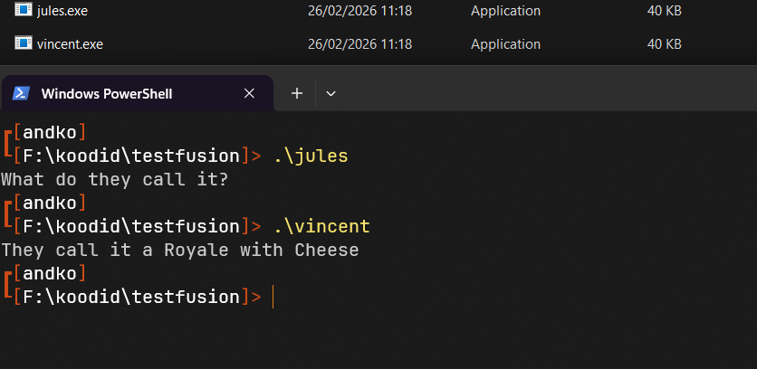
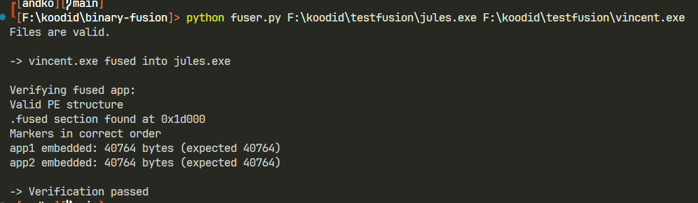
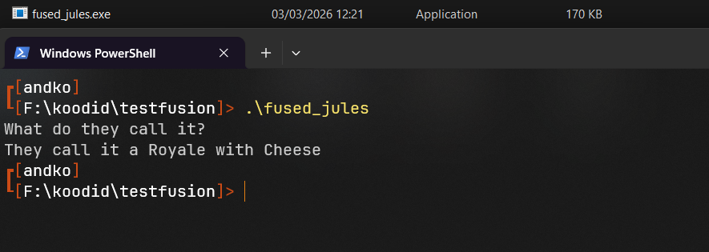
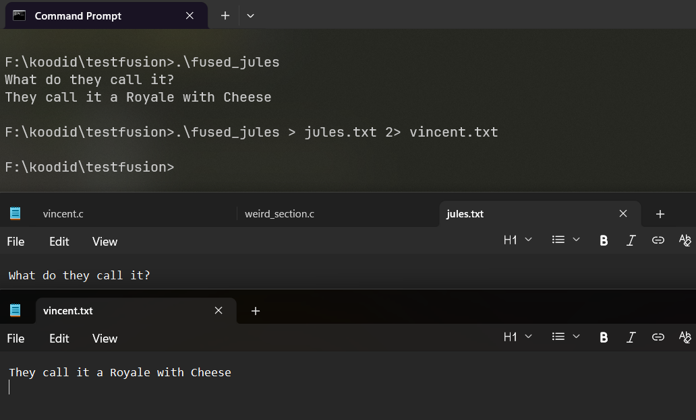

# binary-fusion

This is a tool that combines two executables into a single binary using dropper method. This tool combines the binaries of two executables into a placeholder stub and later executes them sequentially. 

## Prerequisites

* Ability to run PE (.exe) files
* MinGW, to compile C code
* Python 3.13.*+

## Installation

1. Clone the repository

```bash
git clone https://gitea.kood.tech/andreskozelkov/binary-fusion.git

cd binary-fusion
```

2. Create a virtual environment and install the dependencies
```bash
python -m venv .venv

.\.venv\Scripts\Activate.ps1

pip install -r requirements.txt
```

3. Compile the stub
```bash
gcc stub.c -o stub.exe
```
*Note: can be compiled with MinGW64 to support 64 bit files, for now left optional*

4. Run the fuser with any two PE files
```bash
python fuser.py C:\PATH\TO\FILE\jules.exe C:\PATH\TO\FILE\vincent.exe
```

*The path should be absolute*

## Example 

Let's say we have two files, jules.exe and vincent.exe



I want to run the sequentially as one application, possibly to hide malicious file with some other application. I run my fuser with these two files.



The fuse was successful and now we created fused_jules.exe.



If we want to redirect the output of the files to separate .txt files




## Fusion process

First of all fuser validates if the files are compatible. It checks headers for fields like characteristics, magic, machine. Two files should be valid PE binary, the architecture should match (both are 32bit or 64 bit) and if the file is a valid .exe file and not a DLL for example. 

If validation is successful the fuser initializes stub.exe as a placeholder PE file that will hold and run the app1 and app2. It will store the app1 and app2 in the injected .fused section that will contain the raw bytes of both apps (Dropper method). The .fused section will contain 3 markers "FUSED__START__1", "FUSED__START__2", and "FUSED__END_____". Each marker is 15 bytes.

After that validation and fused_*.exe creation the code will run some sanity checks on the fused file and verify it. It checks if the file is a valid PE structure, if it contains .fused section. It will also look inside of the .fused section and look for markers that are needed for execution, also compares the embedded size with the actual size of the files.

At runtime the fused_*.exe will look for the .fused section inside of it, read the raw bytes, look for the app1 using MARKER1 and read it until it finds MARKER2. It will write the application to disk and execute it. Same with app2. The execution will be sequential.

## Legal / Ethical Use

This repository is provided for educational and research purposes only.
Use of this code on systems without explicit authorization may be illegal.
The author is not responsible for misuse of the materials contained in this repository.


